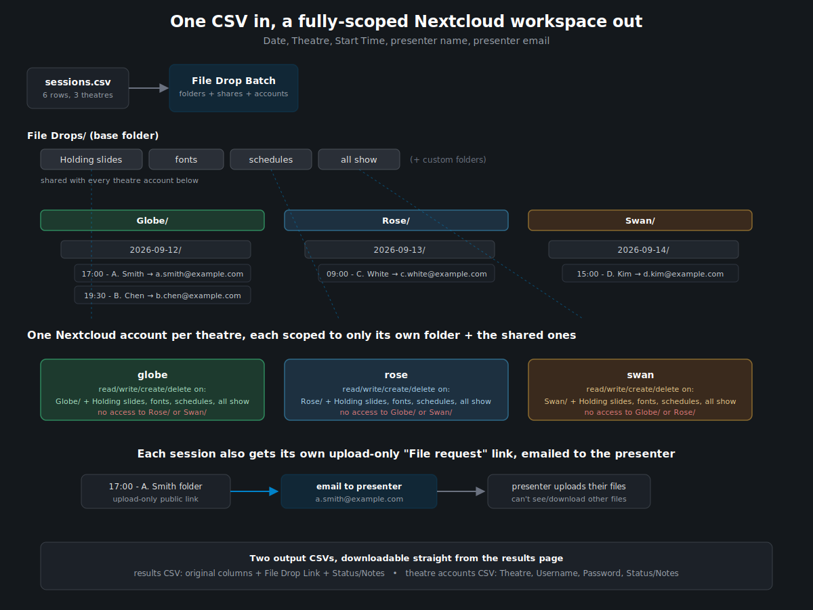
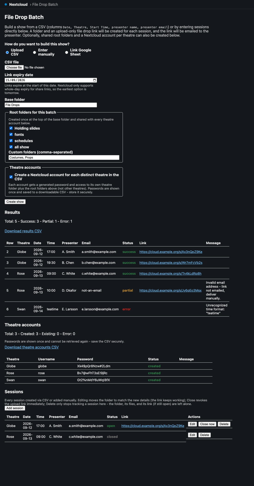
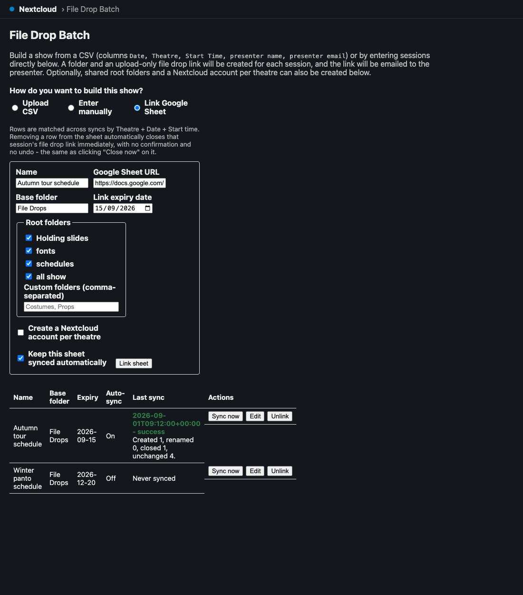
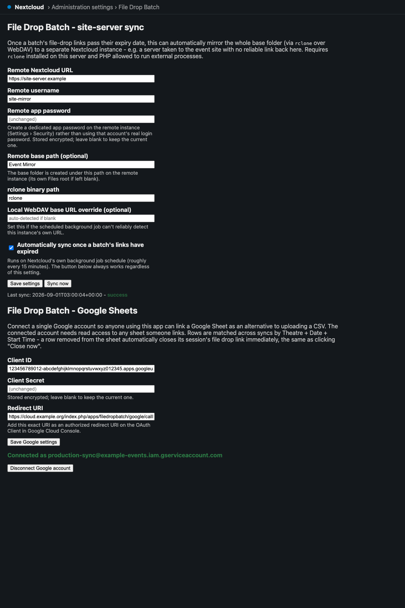

# File Drop Batch

> **AI-assisted project.** This codebase was created with [Claude Code](https://claude.com/claude-code)
> (Anthropic), directed and reviewed by a human author — including the code, the docs,
> and the visuals in this README. Review it yourself before relying on it in production,
> same as you would for any code.

A Nextcloud app for theatre/event production teams. Build a show - from a CSV, entered by hand in the
browser, or synced live from a Google Sheet - and it will:



- create a nested folder per session (`Theatre / Date / "Start Time - Presenter"`),
- create an upload-only "file drop" public link for each folder, with a single expiry date applied to the whole batch,
- email each presenter their link,
- hand back a CSV with a `File Drop Link` column added, when building from a CSV.

Optionally, it can also:

- create a set of shared root folders (`Holding slides`, `fonts`, `schedules`, `all show`, plus custom names) once at the top of the batch, and
- create a Nextcloud account per distinct theatre, scoped to its own theatre folder plus the shared root folders (not other theatres), with a generated password saved to a downloadable CSV. Creating accounts is restricted to admins/subadmins.
- once a batch's file-drop links pass their expiry, automatically mirror the whole base folder to a separate Nextcloud instance (e.g. a server taken to the event site) via `rclone` over WebDAV - see [Site-server sync](#site-server-sync) below.
- track every session in a persistent Sessions list, where you can edit its details, close its link early, or remove it - see [Managing sessions](#managing-sessions) below.
- build a show directly in the browser instead of preparing a CSV, or link a Google Sheet and keep it live-synced, with a row's removal from the sheet automatically closing its session - see [Building a show without a CSV](#building-a-show-without-a-csv) below.

## The upload page



*A static mockup built from the app's real CSS/markup with illustrative sample data (not a live capture) - see [`docs/mockups/app-preview.html`](docs/mockups/app-preview.html).*



*Same mockup approach, showing the Google Sheets mode - see [`docs/mockups/sheets-preview.html`](docs/mockups/sheets-preview.html).*



*The one-time admin setup screen for both the rclone remote and the Google OAuth connection - see [`docs/mockups/admin-settings-preview.html`](docs/mockups/admin-settings-preview.html).*

## Input CSV format

```
Date, Theatre, Start Time, presenter name, presenter email
```

## Installing

**Requirements:** PHP 8.1+ and Nextcloud 27-31 (see `<dependencies>` in `appinfo/info.xml`). No Composer
dependencies at all - the app only uses Nextcloud's built-in OCP APIs (`IRootFolder`, `Share\IManager`,
`IUserManager`, `IMailer`, `IClientService`). Two features are entirely optional and need nothing extra
if you don't use them:

- **Site-server sync** needs `rclone` installed on the server and PHP allowed to spawn external processes (`proc_open`) - see [Site-server sync](#site-server-sync).
- **Google Sheets sync** needs a Google Cloud project with the Sheets API enabled and an OAuth 2.0 Client ID/Secret - see [Building a show without a CSV](#building-a-show-without-a-csv).

Neither is required for the core CSV/manual-entry/file-drop/session-management functionality.

### Option A - install a release (recommended)

1. Download `filedropbatch-<version>.tar.gz` from the [Releases page](https://github.com/allansargeant/nc-filedropbatch/releases).
2. Extract it into your Nextcloud instance's app directory - it already contains the correct `filedropbatch/` top-level folder:
   ```
   tar -xzf filedropbatch-<version>.tar.gz -C /path/to/nextcloud/custom_apps/
   ```
3. Make sure the web server owns the extracted files, e.g. `chown -R www-data:www-data /path/to/nextcloud/custom_apps/filedropbatch`.
4. Enable it, either from **Settings → Apps** in the Nextcloud web UI, or via `occ`:
   ```
   occ app:enable filedropbatch
   ```

### Option B - install from source

Clone this repository and copy (or symlink) `custom_apps/filedropbatch` into your Nextcloud instance's
`custom_apps` (or `apps`) directory, then run the same `occ app:enable filedropbatch` as above. This is
the path used by this repo's own [local dev environment](#local-dev-environment) below.

### After enabling

The app adds a "File Drop Batch" entry to the Nextcloud navigation bar - any logged-in user can open it
and build a show straight away. Nothing further is required unless you want site-server sync or Google
Sheets sync, both of which are configured once by an admin under **Settings → Administration → File Drop
Batch** (see the two linked sections above).

### Note on link expiry

Nextcloud's public link share expiration is date-only: the server truncates both the expiration date and "now" to midnight before comparing, so the earliest valid expiry is always tomorrow, and the share effectively expires at 00:00 on the chosen date regardless of what time you might otherwise expect. This is a platform behavior, not something this app can override.

## Managing sessions

Every session - whether it came from a CSV row or was added one at a time - is tracked in a Sessions list on the main page, with three actions:

- **Edit** changes the theatre, date, start time, or presenter name, and actually **moves the real folder** to match (e.g. renaming the time updates the `"17:00 - A. Smith"` folder itself). This works because Nextcloud shares reference a folder by its internal file id, not its path, so the existing file-drop link keeps resolving to the same folder after the move - the presenter isn't re-emailed, since only the folder location and displayed metadata changed, not the link itself.
- **Close now** revokes that session's file-drop share outright, immediately and irreversibly - there's no grace period, and it can't be reopened (a fresh session would need to be created instead). This only affects that one session; other sessions in the same batch, and the batch's own site-server sync scheduling, are untouched - closing does **not** trigger an early sync.
- **Delete** only removes the session from this list. The real folder, anything uploaded into it, and its share (if not separately closed) are left exactly as they are - if you actually want the folder gone, do that separately in Files.

"Add session" on the same page creates a single session outside of a CSV, through the identical folder/share/email logic as a CSV row (including its own expiry date, since Nextcloud's link expiry is set per-share, not editable after the fact via this app).

A session created or last-touched by a linked Google Sheet can also be closed *for you*, automatically, the moment its row disappears from that sheet - see [Building a show without a CSV](#building-a-show-without-a-csv) above.

## Building a show without a CSV

The main page's "How do you want to build this show?" switcher offers two alternatives to uploading a CSV file:

- **Enter manually** - the same fields a CSV row would have (Theatre, Date, Start time, Presenter name, Presenter email), added a row at a time in the browser and submitted together as one show. Uses the exact same folder/share/email pipeline as a CSV upload - there's no behavioral difference, just a different way to get the rows in.
- **Link Google Sheet** - point the app at a Google Sheet with the same five columns, and it stays synced: a background job re-checks it roughly every 20 minutes (plus a "Sync now" button for on-demand runs), and rows are matched across syncs by **Theatre + Date + Start Time** rather than any hidden ID column, so:
  - a presenter name or email changed on an existing row updates that session (moving its folder if the name or slot changed - the file-drop link itself keeps working, same as a manual edit);
  - a wholly new Theatre+Date+Start Time combination creates a new session, exactly like a new CSV row;
  - **a row removed from the sheet automatically closes that session's file-drop link immediately - no confirmation, no undo.** This is deliberately more aggressive than anything else in this app (deleting a session elsewhere never touches the real folder/share) - an accidental spreadsheet row deletion kills a live upload link the moment the next sync runs. Turn off "Keep this sheet synced automatically" on a linked sheet if this isn't what you want for it.

**Setup (once, by an admin):** in Nextcloud admin Settings → File Drop Batch, under "Google Sheets", create an OAuth 2.0 Client ID in [Google Cloud Console](https://console.cloud.google.com/) (any project with the Google Sheets API enabled), add the "Redirect URI" shown on that settings page as an authorized redirect URI on the client, paste the Client ID/Secret in, save, then click "Connect Google account" and complete Google's consent screen. This is a single, **instance-wide** connection (like the rclone remote credential) - not per-user - so the connected account needs read access to every sheet anyone links, and any signed-in user can then link a sheet from the main page without needing their own Google OAuth setup.

## Site-server sync

Once a batch's file-drop links pass their expiry date (no more uploads expected), a background job can mirror the whole base folder — root folders, theatre folders, everything collected — to a second, separate Nextcloud instance over WebDAV, using [`rclone`](https://rclone.org/). This is meant for the case where the event venue itself has no reliable link back to this server: bring a "site server" pre-loaded with everything up to the last sync before heading out.

**Requirements:** `rclone` installed on this server and reachable on `$PATH` (or point at it explicitly in settings), and PHP allowed to spawn external processes (`proc_open`) — normal on a self-hosted box you control, often disabled on shared hosting. This is a deliberate exception to keeping this app free of external dependencies, scoped to this one optional feature.

**Configure it** under Nextcloud's admin Settings → File Drop Batch: the remote instance's URL, a username, and an **app password** you create on that remote instance (Settings → Security → "Create new app password" — never use a real account password here), plus an optional remote base path and an "automatically sync on expiry" toggle. A "Sync now" button runs it on demand regardless of that toggle, useful for testing the connection.

**How it authenticates:** the destination (remote) leg uses the app password you configure, encrypted at rest. The source (this server) leg never stores a password at all — each sync mints a fresh, short-lived Nextcloud app token for the batch's owner, uses it for the local WebDAV connection, and revokes it immediately afterward, success or failure.

**Scheduling:** a small database table (`fdb_batches`) records each batch's owner, base folder, and expiry date when it's created. A background job (piggybacking on Nextcloud's own cron, so no extra system cron entry is needed) checks roughly every 15 minutes for batches whose expiry has passed and haven't been synced yet, and triggers one whole-folder sync per distinct (user, base folder) pair — not a sync per batch, since `rclone sync` only transfers deltas anyway. A failed sync is logged and left for retry on the next run rather than marked done.

**Set the "local WebDAV base URL" explicitly** if this instance runs behind Docker, a reverse proxy, or anything else where the request that reaches PHP doesn't carry the same hostname the outside world uses. Auto-detection (via Nextcloud's own URL generator) reflects whatever `overwrite.cli.url`/trusted-domain resolution produces for a CLI/cron context, which in a typical `docker-compose` setup resolves to the *host-mapped* address (e.g. `localhost:8080`) rather than the address reachable from *inside* the container where `rclone` actually runs (e.g. plain `http://localhost`, since Apache listens on port 80 internally) - confirmed while testing this exact feature against the bundled dev stack. If the source leg of a sync fails with a connection error despite the destination being reachable, this is almost always why.

## Local dev environment

`docker-compose.yml` brings up a disposable Nextcloud + MariaDB + MailHog stack for development. Credentials are read from a `.env` file (gitignored) rather than committed:

```
cp .env.example .env
# edit .env and set real passwords

docker compose up -d
docker compose exec -u root app chown www-data:www-data /var/www/html/custom_apps
docker compose exec -u www-data app php occ maintenance:install \
  --database mysql --database-host db --database-name nextcloud \
  --database-user nextcloud --database-pass "$(grep DB_PASSWORD .env | cut -d= -f2)" \
  --admin-user admin --admin-pass "$(grep NEXTCLOUD_ADMIN_PASSWORD .env | cut -d= -f2)"
docker compose exec -u www-data app php occ config:system:set mail_smtpmode --value=smtp
docker compose exec -u www-data app php occ config:system:set mail_smtphost --value=mailhog
docker compose exec -u www-data app php occ config:system:set mail_smtpport --value=1025
docker compose exec -u www-data app php occ config:system:set mail_smtpauth --value=0 --type=integer
docker compose exec -u www-data app php occ app:enable filedropbatch
```

Nextcloud is then available at `http://localhost:8080` (log in with the admin user/password you set in `.env`) and MailHog at `http://localhost:8025`.

The manual `chown`/`maintenance:install` steps are needed because the `custom_apps` directory ships owned by `root` in the official image, which makes the container's own automatic installer fail on a fresh volume.

Two sample CSVs are included: `sample-sessions.csv` (a clean golden-path file) and `sample-sessions-edge-cases.csv` (duplicate rows, invalid email, bad date/time, missing fields, to exercise the success/partial/error paths).

### Testing the site-server sync locally

`docker-compose.site-server.yml` stands up a second, independent Nextcloud instance to act as the "site server" - useful for exercising the rclone sync feature end-to-end without a real second machine. It needs its own set of `.env` values (`SITE_DB_ROOT_PASSWORD`, `SITE_DB_PASSWORD`, `SITE_ADMIN_USER`, `SITE_ADMIN_PASSWORD` - see `.env.example`) and runs as a separate compose project so it doesn't collide with the primary stack:

```
docker compose --env-file .env -p fdb-site -f docker-compose.site-server.yml up -d
```

This exposes the site instance at `http://localhost:8081`. From inside the primary `app` container, reach it via Docker Desktop's `http://host.docker.internal:8081` (its published port isn't reachable via `localhost` from another container) - that's the URL to enter as the "Remote Nextcloud URL" in admin settings, with an app password created on the site instance (Settings → Security) as the remote password. `rclone` itself isn't bundled in the official Nextcloud image, so install it into the primary container for testing: `docker compose exec -u root app bash -c "curl -s https://rclone.org/install.sh | bash"`.

To simulate a batch's expiry actually having passed (new batches always require an expiry of at least tomorrow, so none will be naturally due yet), backdate it directly: `docker compose exec db mysql -u nextcloud -p"$DB_PASSWORD" nextcloud -e "UPDATE oc_fdb_batches SET expiry_date = '2020-01-01' WHERE id = 1;"`. Then either wait for real cron activity, or trigger the specific job immediately for testing with `occ background-job:list` (to find its id) followed by `occ background-job:execute <id>` - `cron.php` alone only advances one due job per invocation (by design, matching how a real system cron ticks over time), so repeated manual invocations aren't a reliable way to test a specific job on demand.

## Roadmap / TODO

- [ ] Replace the static README mockup with a live screenshot captured from a running instance (the local `docker-compose` dev stack above stands one up).

## License

AGPL-3.0, matching Nextcloud's own app licensing convention.
