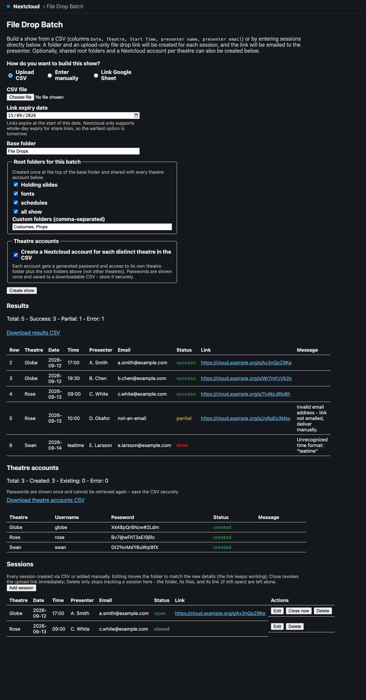
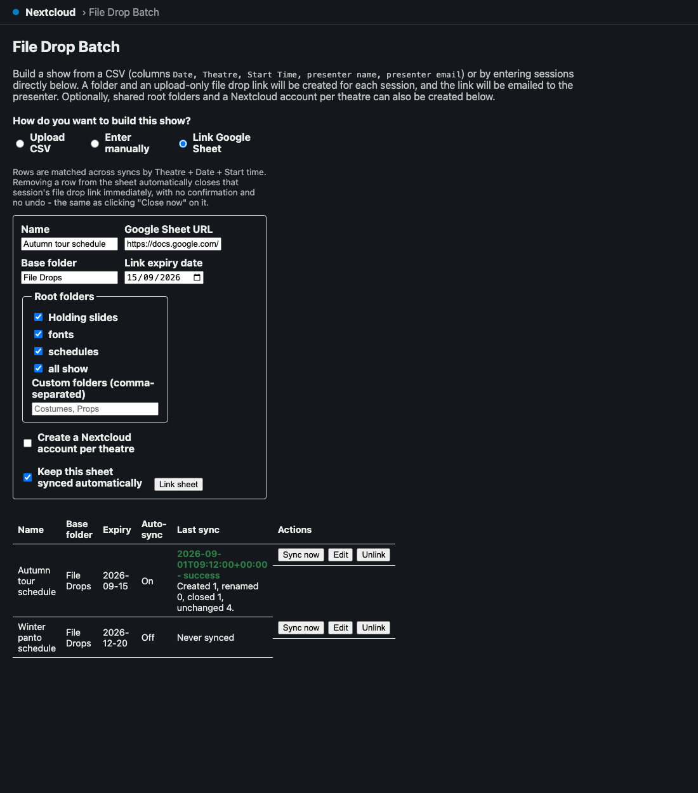
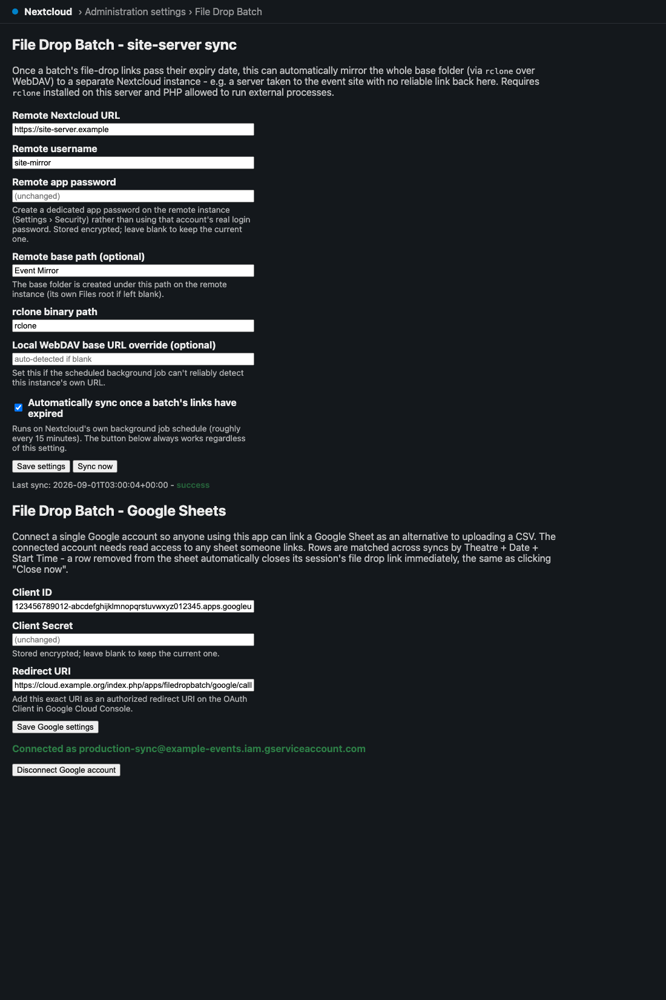

# File Drop Batch user guide

For the production coordinator running the show. The [README](../README.md) covers installing
the app and the one-time admin setup; this is how to run a batch, and the things that go wrong.

---

## What this app actually does to your server
Worth being clear about before you press the button, because three of these are irreversible or
visible to people outside your organisation:

- It **creates public upload links** that anyone with the URL can write to.
- It **sends real email to real presenters**, immediately, with no preview and no undo.
- Optionally it **creates real Nextcloud accounts** with generated passwords, downloadable as a
  CSV. That's restricted to admins and subadmins.
- Optionally it **mirrors your folder tree to another server** with `rclone sync`, which
  **deletes files at the destination that aren't in the source** ([Site-server sync](#site-server-sync)).

There is no dry-run mode. **Test with two rows and your own email address before you run a
90-session batch.**

This is an AI-assisted codebase, directed and reviewed by a human author — review it before
relying on it in production, the same as any code.

---

## The session CSV
Five columns, matched case-insensitively. Order doesn't matter and extra columns are ignored.

```
Date, Theatre, Start Time, presenter name, presenter email
```

Any missing column **aborts the whole file** with a message naming what's absent — nothing is
created, so a rejected CSV is safe to fix and re-upload.

**The same CSV drives [resolve-configurator](https://github.com/stoatworks-labs/resolve-configurator)**,
which builds the DaVinci Resolve project for the same event. Keep one file, feed it to both.

### Dates are read day-first

Accepted date formats, tried **in this order**:

```
2026-08-01   01/08/2026   08/01/2026   01-08-2026   1 Aug 2026   1 August 2026
```

Because `d/m/Y` is tried before `m/d/Y`, **`03/04/2026` is read as 3 April, not 4 March.** There
is no setting to change this. If your schedule came from a US source, every date where the day
is 12 or lower will silently land on the wrong day — and the folder will still be *named* from
the original string, so it will look right in the file tree while being wrong in validation.

**Use `2026-08-01` format and the ambiguity disappears.**

Times accept `14:00`, `14:00:00`, `2:00pm`, `2:00 pm`, `2:00 PM`, `2.00pm`.

Anything the format list rejects falls through to a very permissive general parser, which will
accept things a spreadsheet never meant. A value that parses is never questioned.

### Folder names

```
<base folder>/<Theatre>/<Date>/<Start Time> - <Presenter Name>
```

Characters that can't go in a folder name (`/ \ : * ? " < > |`) are **replaced with `-`**, not
removed — so `10:00` becomes `10-00`, and two sessions at `10:00` and `1000` stay distinct.
Names are trimmed to 200 characters. An entirely unusable name becomes `untitled`.

The date folder is named from **exactly what you typed**. `2026-08-01` and `1 Aug 2026` are the
same day to the validator and **two different folders** on disk. Be consistent within a show.

---

## Setting the expiry
One expiry date applies to the whole batch, and it is required.

> **⚠ Nextcloud link shares expire at day granularity, and expiry is at 00:00.** The time of day
> is ignored entirely, so a link set to expire on the 5th stops working at the *very start* of
> the 5th — it does not last through that day. **Set the expiry to the day after you want
> uploads to stop.**
>
> This also means today is always rejected as "in the past". The earliest valid expiry is
> tomorrow.

---

## The app



*One page, top to bottom: choose a source (CSV, manual entry or a linked Google Sheet), set the
expiry and base folder, pick the shared root folders, then **Create show**. Everything below the
button is the outcome.*

---

## Reading the results
Every row comes back as `success`, `partial` or `error`, and **`partial` is the one that needs
you**:

| Status | What happened | Your action |
|---|---|---|
| **success** | Folder created, link created, **email sent** | none |
| **partial** | Folder and link created, **email NOT sent** | **Send the link by hand.** It's live and works. |
| **error** | No usable link | Fix the row, re-run |

`partial` happens either because the email address didn't look valid, or because the mail server
refused it. The `message` column tells you which. Either way the presenter has nothing until you
act — a batch that reports "10 success, 2 partial" has **two people who don't know they have an
upload link.**

An `error` row may still have left a folder behind, if folder creation worked and the link
didn't. The message says so.

**Download both CSVs before you close the page.** The results CSV (your input plus a
`File Drop Link` column) and, if you created accounts, the users CSV. They're not stored
anywhere retrievable — the Sessions list keeps the sessions, not the CSVs, and **the generated
passwords are never shown again.**

### Re-running a batch creates duplicates

Session folders are not reused. Running the same CSV twice gives you
`10:00 - Jane Smith` **and** `10:00 - Jane Smith (2)`, each with its own link, and emails Jane
twice. Fix errors by re-running **only the failed rows**, not the whole file.

(Root folders and theatre accounts *are* reused, so those are safe to re-run.)

---

## Theatre accounts
Optional, admin/subadmin only. Creates one Nextcloud account per distinct theatre name, scoped
to **its own theatre folder plus the shared root folders — deliberately not other theatres.**
That isolation is the point of the feature.

Two things to watch:

- **The username comes from the theatre name**, lowercased with anything outside `a-z0-9._-`
  turned into `-`. So **"Studio One" and "studio-one" and "STUDIO/ONE" all become `studio-one`
  and share a single account.** If two genuinely different theatres sanitize to the same
  username, the second silently reuses the first's account — and gets access to the first's
  folder. Name theatres distinctly.
- **An account that already existed comes back with a blank password**, because the app can't
  read an existing password. A blank password column means "already there", not "no password".

Passwords are 16 characters, generated with a CSPRNG, guaranteed to contain upper, lower, digit
and symbol, using an ambiguity-avoiding alphabet (no `I`/`l`/`0`/`1`).

---

## Managing sessions afterwards
The Sessions list tracks every session that was created (`success` and `partial` rows —
`error` rows leave no record).

- **Editing a session moves its folder** to match the new theatre/date/time/presenter.
- **The link keeps working across that move**, because Nextcloud shares point at a file by id,
  not by path.
- **Editing does not re-email the presenter**, deliberately — a typo correction shouldn't spam
  them. If someone needs a *new* link, create a new session.
- **Closing a session ends its link early**, before the batch expiry.

---

## Google Sheets sync



*The last-sync column reports what each sync actually did — "Created 1, renamed 0, closed 1,
unchanged 4" — which is where you find out that a row you deleted from the sheet has closed
somebody's upload link.*
Link a sheet and it's re-read on a schedule, so late additions get folders and links without you
running anything.

The sheet must satisfy **exactly the same column contract as a CSV** ([The session CSV](#the-session-csv)) — same five headers,
same parsing, same day-first date rule.

> **⚠ Deleting a row from the sheet closes that session's link.** That's the designed
> behaviour, and it's live: someone tidying up the spreadsheet can revoke a presenter's upload
> link without realising. Treat the linked sheet as production data.

Because the Sheets API omits trailing empty cells, a blank row arrives as an empty array and is
skipped rather than erroring.

---

## Site-server sync



*Both of these are configured once, by an administrator, in **Administration settings › File Drop
Batch** — not in the app page everyone else uses.*
Once a batch's links pass their expiry, a background job can mirror the whole base folder to a
second Nextcloud instance — the "site server" you take to the venue.

> **⚠ It is `rclone sync`, not a copy. The destination is made to *match* the source: anything
> at the destination that isn't in the source is deleted.** If someone adds or edits files on
> the site server between syncs, the next sync removes their work. Treat the site server as a
> read-only mirror, and do the editing on the main server.

Other things to know:

- It fires on **expiry**, not on completion. Roughly every 15 minutes a job checks for batches
  whose expiry has passed. A failed sync is logged and **retried next run**, not marked done.
- Syncs are **per (user, base folder)**, not per batch — one whole-folder transfer covers every
  batch sharing that folder.
- The **"Sync now" button ignores the automatic toggle**, which makes it the right way to test
  the connection.
- Use an **app password** from the remote instance (Settings → Security → Create new app
  password), never a real account password. It's encrypted at rest.
- The source side stores no password at all: each sync mints a short-lived token and revokes it
  immediately afterwards, whether or not the sync worked.

**If the source leg fails with a connection error but the destination is reachable**, set the
"local WebDAV base URL" explicitly. Behind Docker or a reverse proxy, auto-detection produces
the *host-mapped* address (`localhost:8080`) rather than the address reachable from *inside* the
container where rclone runs (`http://localhost`). This is by far the most common sync failure.

Needs `rclone` on the server and PHP allowed to spawn processes (`proc_open`) — normal on a box
you control, often disabled on shared hosting.

---

## Troubleshooting
| Symptom | Cause |
|---|---|
| **"The CSV is missing required column(s)"** | Header names don't match ([The session CSV](#the-session-csv)). Nothing was created — safe to fix and retry. |
| **"The expiry date must be at least tomorrow"** | Nextcloud expires links at 00:00 on the chosen day ([Setting the expiry](#setting-the-expiry)). |
| **Links stopped working a day early** | Same cause — expiry is at the *start* of the date ([Setting the expiry](#setting-the-expiry)). |
| **Sessions on the wrong day** | US-format dates read day-first ([The session CSV](#the-session-csv)). |
| **Two folders for one day** | The date was typed two different ways; folders are named from the raw string ([The session CSV](#the-session-csv)). |
| **Presenter says they never got a link** | Check for a `partial` row — the link exists and wasn't emailed ([Reading the results](#reading-the-results)). |
| **Duplicate folders and double emails** | The batch was run twice; session folders are never reused ([Reading the results](#reading-the-results)). |
| **Two theatres share one account** | Their names sanitize to the same username ([Theatre accounts](#theatre-accounts)). |
| **Blank password in the users CSV** | That account already existed ([Theatre accounts](#theatre-accounts)). |
| **Lost the generated passwords** | They're not recoverable — reset from Nextcloud's user admin ([Reading the results](#reading-the-results)). |
| **A presenter's link died unexpectedly** | Someone deleted their row from the linked Google Sheet ([Google Sheets sync](#google-sheets-sync)). |
| **Files vanished from the site server** | `rclone sync` deleted what wasn't in the source ([Site-server sync](#site-server-sync)). |
| **Sync fails on the source leg only** | The local WebDAV base URL needs setting explicitly ([Site-server sync](#site-server-sync)). |
| **"Only admins or subadmins can create theatre user accounts"** | Working as intended — that restriction is deliberate. |
| **Nothing syncs automatically** | Nextcloud's cron isn't running, or the toggle is off. Try "Sync now" to separate the two. |

---

## Before a big batch
1. Use `YYYY-MM-DD` dates in the sheet ([The session CSV](#the-session-csv)).
2. Set the expiry to **the day after** uploads should stop ([Setting the expiry](#setting-the-expiry)).
3. Run **two rows to your own address first** — there's no dry run and no undo on the emails.
4. Check theatre names don't collide once lowercased and hyphenated ([Theatre accounts](#theatre-accounts)).
5. Run the real batch, then **download both CSVs before leaving the page** ([Reading the results](#reading-the-results)).
6. Work the `partial` rows — those presenters have nothing yet ([Reading the results](#reading-the-results)).
7. If site-server sync is on, remember the site server is a mirror, not a workspace ([Site-server sync](#site-server-sync)).

---

## See also

- [API.md](API.md) — routes, the CSV contract, config keys, tables, jobs
- [DEVELOPING.md](DEVELOPING.md) — dev stack, tests, security rules
- [README](../README.md) — install, screenshots, admin setup
